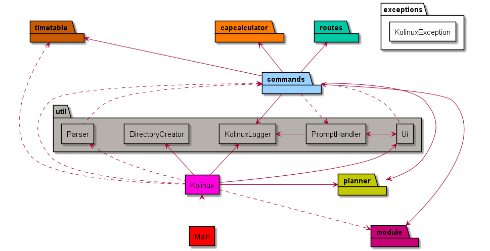
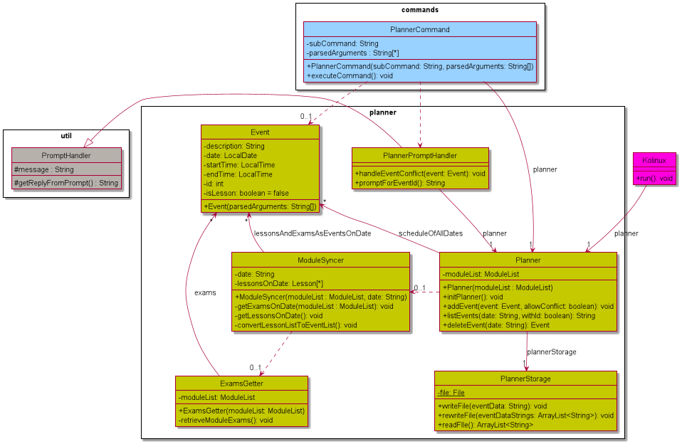
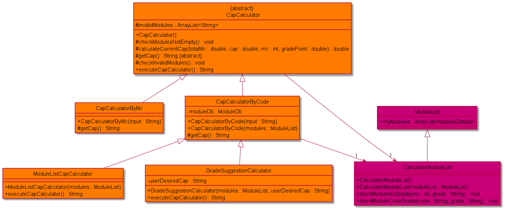
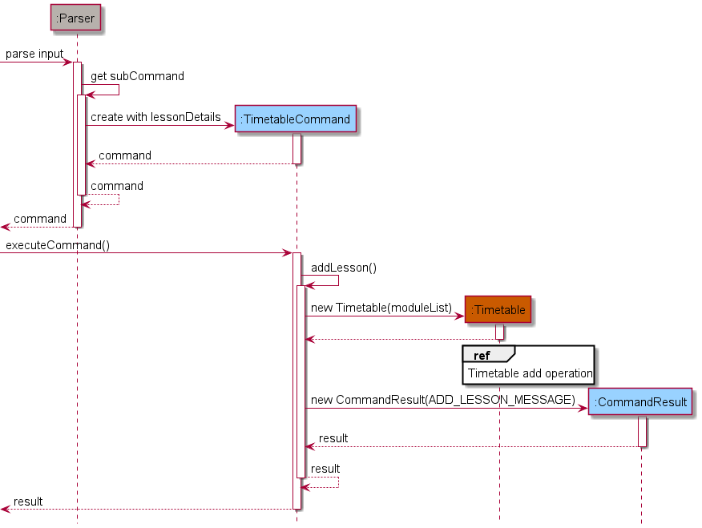
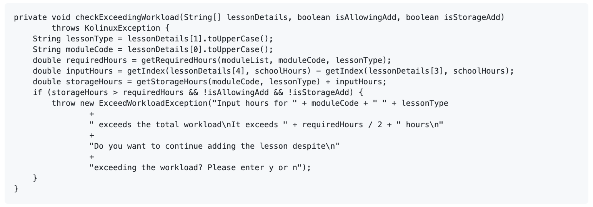
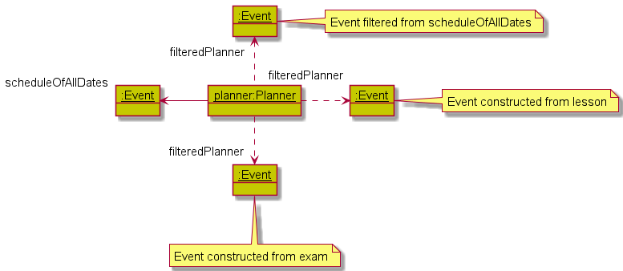
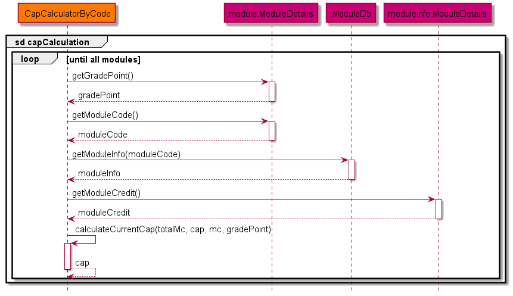

# Welcome to Kolinux Developer Guide 😎

## Introduction

This Developer Guide is designed for developers interested in working with _Kolinux_ in the following manner:
1. Customise _Kolinux_ for specific operating needs
2. Extend the functionality of _Kolinux_

This guide will bring you through the [overall design](#design) of _Kolinux_, the various 
[implementations](#implementation) and their mechanisms. We have also provided insights into our 
[target users](#target-user-profile) to allow you to better understand the reasons behind the various methods 
of implementations.

## Table of Contents
* [Acknowledgements](#acknowledgements)
* [Setting up and Getting started](#setting-up-and-getting-started)
* [Design](#design)
* [Implementation](#implementation)
  * [`timetable add`](#add-to-timetable-feature)
  * [`planner add`](#add-to-planner-feature)
  * [`module add & delete`](#add-and-delete-a-module-by-module-code-feature)
  * [`cap code`](#cap-calculator-by-module-code-feature)
  * [`bus`](#bus-routes-feature)
* [Product Scope](#product-scope)
  * [Target user profile](#target-user-profile)
  * [Value proposition](#value-proposition)
* [User Stories](#user-stories)
* [Non-Functional Requirements](#non-functional-requirements)
* [Glossary](#glossary)
* [Instructions for manual testing](#instructions-for-manual-testing)
## Acknowledgements

* User Guide and Developer Guide of [AddressBook Level-3](https://se-education.org/addressbook-level3/)
* [NUSMods API](https://api.nusmods.com/v2/) 
* [GSON](https://github.com/google/gson)
* [JUnidecode](https://github.com/gcardone/junidecode)

## Setting up and getting started

### Setting up

1. Fork our [repository](https://github.com/AY2122S1-CS2113T-W11-1/tp) and clone into your computer
2. Configure JDK: Ensure your IDE is configured to JDK 11
3. Import the project as a Gradle Project 
4. Verify the setup by running `seedu.Kolinux.Main`
   1. [Try out a few commands](#instructions-for-manual-testing) and ensure they're working properly
   2. Run the tests and ensure all of them past the test cases

### Before writing code

1. Configure the code style
   * Ensure that your coding style matches our coding style
2. Set up Continuous Integration
   * This project comes with a `gradle.yml` file so each time you push, Github will run the CI
   for your project automatically.
3. Learn the design
   * Look through the overall design by looking through [Kolinux's overall architecture](#design)
   

## Design

### Main Components of the Architecture

This section describes the overall design architecture of _Kolinux_.

The `Main` class is responsible for initializing the main components upon start-up of the application, and 
deciding the execution path of the application through the main components based on reading the user inputs.

The application consists of the following main components responsible for the high-level execution of a user input:
1. `Kolinux`: Initializes the components in the correct sequence, and connects them up with each other.
2. `util`: Collection of utility classes.
   * `util.Ui`: User interface of the application.
   * `util.Parser`: Makes sense from the user input and decides which `Command` class to initialize.
   * `util.DirectoryCreator`: Ensures the `/data` directory is created and present for data storage.
   * `util.KolinuxLogger`: Logs the user activity into `data/logger.log`.
   * `util.PromptHandler`: Handles prompts when user confirmation is required to perform certain operations.
3. `commands`: Collection of user commands that determines execution.
4. `routes`: Collection of classes used by Bus Route Finder feature.
5. `module`: Collection of classes used by Module Manager feature.
6. `timetable`: Collection of classes used by Timetable feature.
7. `planner`: Collection of classes used by Planner feature.
8. `capcalculator`: Collection of classes used by CAP Calculator feature.

The architecture diagram below shows a high-level overview of the structure between different components. 

❕ _Note: Each component is coded with a different colour and the same colour coding is applied to the rest of this 
document._



#### Commands Component

The class diagram below describes the structure of the `commands` component.

❕ _Note: XYZCommand in this diagram represents HelpCommand, ExitCommand, and InvalidCommand._


All `Command` classes inherit from the abstract `Command` class, which has an association with `KolinuxLogger` so that
every command execution has a corresponding log in `data/logger.log`. The structure between each individual command and other components are 
also shown in the diagram above. These structures will be further elaborated in the sections below.

#### Module Component

The class diagram below models the structure of the `module` component


The `ModuleCommand` class is responsible for the execution of all `module` related commands. It inherits references 
to instances of `ModuleList` and `ModuleDb` from `Command`  which are utilized for maintaining a list of
`ModuleDetails` instances and operating a repository of `moduleDetails`( `ModuleDb`) respectively. `ModuleCommand` 
also interacts with `ModuleListStorage` to facilitate the persistent storage of the contents of `ModuleList`. 

#### Timetable Component

The class diagram below describes the structure within in the `timetable` component


The `Timetable` class is the main part in this component that is responsible for all `timetable` related command 
executions. `Timetable` maintains a list of all `Lesson`s in `lessonStorage` and an association with
`TimetableStorage` for storage of `Lesson` data in `data/timetable.txt`.`Lesson` has 3 types `Tutorial`, 
`Lecture` and `Lab` which are specified by its lesson type, `TUT`, `LEC` and `LAB` respectively. 
`AddSubCommand`, `DeleteSubCommand`, `UpdateSubCommand` and `ViewSubCommand` are called to execute 
`timetable add`, `timetable delete`, `timetable update` and `timetable view` commands respectively.

#### Planner Component

The class diagram below describes the structure within the `planner` component.



The `Planner` class is the main part in this component that is responsible for all `planner` related command
executions. The `Planner` maintains a list of all existing `Event`s, and an association with `PlannerStorage` for
storage of `Event`s data in `data/planner.txt`. To communicate with other components such as `timetable` and `module`,
the `ModuleSyncer` and `ExamsGetter` are the main bridges to fetch `Lesson`s and exams data for `Planner`.

#### CAP Calculator Component

The class diagram below describes the structure between `CapCalculator` and its subclasses.



The `CapCalculator` is an abstract representation of calculator which is inherited by every calculator classes.
It contains the list of modules whose grade are being retrieved to calculate the overall cap within 
`CalculatorModuleList`, which is a subclass of `ModuleList` designed specifically for `CapCalculator`. Its subclasses
can be divided into two groups based on the module format, namely `CapCalculatorByMc` which calculates cap of modules
containing only the modular credit and the corresponding grade, and `CapCalculatorByCode` and its subclasses which can
retrieve modular credit of each module from `moduleDb` for the calculation.

#### Bus Routes Finder Component
The class diagram below describes the interaction between `Route` and its subclasses.


The `Route` class is a higher level representation of the process to find routes. The `DirectRoute` and `IndirectRoute`
classes inherit from the `Route` class. The `BusRouteCommand` instantiates `DirectRoute` and `IndirectRoute` objects.
The `DirectRoute` class is responsible to check if there are any direct or direct alternate routes between the 2 user 
given bus stops. The `IndirectRoute` class is responsible to find if there are any indirect routes between the 2 user 
given bus stops, i.e a route wherein a user will need to switch buses at an intermediate bus stop. The process of checking
whether 2 points on a graph are connected is facilitated by the `Graph` class and achieves this process by using BFS. A
`Location` class object is instantiated by the `BusRouteCommand` class if the user wants to view the list of all bus stops
in the network.

### Command Execution

The sequence diagram below shows a high-level overview of the interaction between entities during the execution
of a user input _(XYZCommand represents any class that inherits from Command)_.


## Implementation

This section describes some noteworthy details on how some features are implemented along with more detailed
representations of the interactions between components.

### Add to timetable feature

The timetable add mechanism is facilitated by `Timetable` where the format of the input is as such: 
`timetable add MODULE_CODE/LESSON_TYPE/DAY/START_TIME/END_TIME`. The lessons added to `Timetable` 
via `inputLesson(String[] lessonDetails)` is stored in the `lessonStorage` within the program via 
the method `addLesson(Lesson lesson)` and locally in `TimetableStorage` which saves it 
to `timetable.txt` file to constantly save the lessons' data. It implements the following operations:

* `Timetable#inputLesson(String[] lessonDetail)` containing `Timetable#addLesson(Lesson lesson)` - Adds the lesson 
to `timetableStorage` based on the type of lesson it is, which is included in the lessonDetail.
* `TimetableStorage#writeToFile()` - Saves the lesson details to `timetable.txt` locally.

#### ❕ Notes about the methods:

* `String[] lessonDetails` consists of `MODULE_CODE`, `LESSON_TYPE` (`TUT` - tutorial, `LEC` - lecture or `LAB` - lab), 
`DAY`, `START_TIME`, `END_TIME`. 
* Lesson class is inherited by `Tutorial`, `Lecture` and `Lab` to add lessons based on the `LESSON_TYPE` as shown 
in the example below.

Given below are the examples of the usage of `timetable add` of lessons to the timetable.

Example 1: Adding a tutorial to the `lessonStorage` ( lesson of type `TUT` )


Example 2: Adding a lecture to the `lessonStorage` ( lesson of type `LEC` )


Example 3: Adding a lab to the `lessonStorage` ( lesson of type `LAB` )


The following sequence diagrams shows the `timetable add` mechanism:

❕Note: The sequence diagram for the add mechanism has been split into 2 parts for better readability:
* The following diagram shows the sequence of parsing the user input and executing `TimetableCommand#addLesson()`
for the `timetbale add` command



* The following diagram shows the sequence of adding the specified lesson from the user input to the 
timetable via `Timetable#executeAdd(lessonDetails)` which is then written to the `timetable.txt` storage 
file via `TimetableStorage#writeToFile()`


* Due to a few inaccuracies in the api for the prescribed workload for certain modules, users are given the liberty to
exceed the workload whilst displaying a warning as to what the prescribed workload is. For this we have made use of the 
`PromptHandler` just like we did in `planner` to get a reply from the user in order to continue adding with the lesson.
* The following code illustrates how to check if the lesson inputted exceeds the workload.


[comment]: <> (```)

[comment]: <> (private void checkExceedingWorkload&#40;String[] lessonDetails, boolean isAllowingAdd, boolean isStorageAdd&#41;)

[comment]: <> (        throws KolinuxException {)

[comment]: <> (    String lessonType = lessonDetails[1].toUpperCase&#40;&#41;;)

[comment]: <> (    String moduleCode = lessonDetails[0].toUpperCase&#40;&#41;;)

[comment]: <> (    double requiredHours = getRequiredHours&#40;moduleList, moduleCode, lessonType&#41;;)

[comment]: <> (    double inputHours = getIndex&#40;lessonDetails[4], schoolHours&#41; - getIndex&#40;lessonDetails[3], schoolHours&#41;;)

[comment]: <> (    double storageHours = getStorageHours&#40;moduleCode, lessonType&#41; + inputHours;)

[comment]: <> (    if &#40;storageHours > requiredHours && !isAllowingAdd && !isStorageAdd&#41; {)

[comment]: <> (        throw new ExceedWorkloadException&#40;"Input hours for " + moduleCode + " " + lessonType)

[comment]: <> (                +)

[comment]: <> (                " exceeds the total workload\nIt exceeds " + requiredHours / 2 + " hours\n")

[comment]: <> (                +)

[comment]: <> (                "Do you want to continue adding the lesson despite\n")

[comment]: <> (                +)

[comment]: <> (                "exceeding the workload? Please enter y or n"&#41;;)

[comment]: <> (    })

[comment]: <> (})

[comment]: <> (```)




* The following sequence diagram illustrates what happens when input hours exceed the workload and what the program
does to handle this exception before adding the lesson to the timetable.


### Add to Planner feature

The Add to Planner mechanism is mainly facilitated by `PlannerCommand`, `Planner`, and `PlannerPromptHandler`. After entering the appropriate
input to add an `Event` to the `Planner`, `PlannerCommand` is constructed with `subCommand` `add` and the
relevant `parsedArguments`. The constructor of `PlannerCommand` involves creation of `Planner` and `PlannerStorage`
to initialize the adding and writing to file operations.

Before the `Event` is added, it is first checked for any time conflicts with existing events/lessons/exams. `Event`s
are only added if there are no time conflicts or the user allowed the addition of the conflicted `Event` through a
prompt to get a confirmation from the user. `Event`s added to the `Planner` are stored in a list
`scheduleOfAllDates` which contains all added `Event`s by the user. The data in this list is also written to the
internal storage `data/planner.txt` through `PlannerStorage` which saves the user data locally.

This mechanism is implemented by the following methods:
* `Planner#addEvent(Event event, boolean allowConflict)`: Attempts to add `event` to `scheduleOfAllDates` by invoking
the following methods:
    * `Planner#hasTimeConflict(Event event)`: Checks for any time conflicts between `event` and any existing `Event`s
      in `scheduleOfAllDates`, lessons, and exams.
    * `PlannerStorage#writeFile(String data)`: Appends the data of the newly added `Event` to `data/planner.txt` for 
      local storage.

* `PlannerPromptHandler#getReplyFromPrompt()`: Gets user confirmation to allow or cancel the add operation
in case of a time conflict.

The figures below represent the sequence diagrams of the Add to Planner mechanism:


The `Planner#hasTimeConflict(Event event)` method is integrated with `Timetable` and `ModuleList` so that `Lesson`s and
exams may be fetched in addition to `scheduleOfAllDates` containing the `Event`s to check time conflicts against. The
integration in the method is mainly done via the `Planner#filterPlanner(String date)` call. The code snippet below
shows how `Planner#hasTimeConflict(Event event)` invokes `Planner#filterPlanner(String date)`. The return value
`filteredPlanner` will contain all the existing events/lessons/exams occurring on the date of the `event` that 
is to be added.


[comment]: <> (```)

[comment]: <> (private boolean hasTimeConflict&#40;Event eventToBeAdded&#41; {)

[comment]: <> (    ArrayList<Event> filteredPlanner = filterPlanner&#40;eventToBeAdded.getDate&#40;&#41;&#41;;)

[comment]: <> (    String startTime = eventToBeAdded.getStartTime&#40;&#41;;)

[comment]: <> (    String endTime = eventToBeAdded.getEndTime&#40;&#41;;)

[comment]: <> (    for &#40;Event event : filteredPlanner&#41; {)

[comment]: <> (        if &#40;!&#40;startTime.compareTo&#40;event.getEndTime&#40;&#41;&#41; >= 0 || endTime.compareTo&#40;event.getStartTime&#40;&#41;&#41; <= 0&#41;&#41; {)

[comment]: <> (            return true;)

[comment]: <> (        })

[comment]: <> (    })

[comment]: <> (    return false;)

[comment]: <> (})

[comment]: <> (```)


The main working mechanism of `Planner#filterPlanner(String date)` is as follows:
1. Construct a `ModuleSyncer` object with the `date` specified. The object will populate a list of `Event`s that are
constructed using the information of the lessons and exams occurring on `date` using the data fetched from `Timetable` 
and `ModuleList`. Note that an `ExamsGetter` is used by `ModuleSyncer` to interact with `ModuleList` to get the exam 
dates and times of the modules stored by `ModuleList`.
2. Get a list of all `Event`s stored in `scheduleOfAllDates` that occur on `date`.
3. Merge both lists.
4. Sort the list by their start times, and return the list.

The list returned will then be used to check for any time conflicts with `eventToBeAdded`.

The object diagrams below show the object structure in the memory immediately before and after `Planner#filterPlanner(String date)` is invoked to 
fetch `Lesson` and `ModuleDetails` from `Timetable` and `ModuleList` respectively. Assume there is only one `Lesson`, 
one `ModuleDetails`, and one `Event` stored in `Timetable`, `ModuleList`, and `Planner` respectively, and they all occur on the same `date`.




### Add and delete a module by module code feature

The `ModuleCommand` class extends the `Command` class and handles all module related commands. In the context of storage and deletion, operations are performed on a list of `ModuleDetails` encapsulated in an instance of  `ModuleList` (`moduleList`). The `ModuleList` class implements the following methods to achieve this:

- `ModuleList#addModuleByCode(String code, ModuleDb moduleDb)`
- `ModuleList#deleteModuleByCode(String code)`

❕ Notes about the methods:

`moduleDb` is an instance of `ModuleDb` that contains a hashmap, relating each module's code (key) to its respective `ModuleDetails` (value). For storing a module, a `ModuleDetails` instance corresponding to a module code is appended to the list in `moduleList`.

The input format for storage and deletion of modules is as follows:

- Storage: `module add MODULE_CODE`

- Deletion: `module delete MODULE_CODE`

  

Given below are examples of the usage of `module add/delete` and how the add/delete system behaves at each step.

Step 1: The user launches the application. `myModules` , the list of `ModuleDetails` instances, is initialized with the latest saved modules from local storage. If no modules are stored, the resulting list will be empty.

Example: `myModules` is initialized with single `ModuleDetails` instance corresponding to `CS2113T`


Step 2: The user executes `module add CS2101` command to store information regarding `CS2101` in a new instance of `ModuleDetails` and append it to `myModules`. The `module add` prefix ensures `ModuleList#addModuleByCode(String code, ModuleDb moduleDb)` is called. 


Step 3: The user executes `module delete CS2101` command to delete the instance of `ModuleDetais` corresponding to `CS2101` from `myModules`. The `module delete` prefix ensures `ModuleList#deleteModuleByCode(String code)` is called. 


The following sequence diagram models how the `module add` operation works:


The `module delete` operation follows a similar sequence. Instead of calling the ModuleCommand#storeModule() method, the ModuleCommand#deleteModule() method is invoked. Internally, this calls the `deleteModuleByCode` method from `moduleList`. All other steps remain the same. 


### CAP Calculator by module code feature

This cap calculation is managed using `CapCalculatorByCode`. It extends `CapCalculator` which stores
the input modules and grades from user as a `CalculatorModuleList`, which is a subclass of `ModuleList` 
dedicated for cap calculation. 

When the command `cap code` is given by the user, the constructor is called to retrieve and store the modules 
from the input. After the object construction is done, `CapCalculator#executeCapCalculator()` method is then 
invoked for the cap calculation. 

In order to achieve these functionalities, the following methods from `CapCalculatorByCode` are invoked.

* `CapCalculatorByCode#getInputModules(String input)` — which retrieves the module codes and grades from String input
and store them as `CalculatorModuleList`
* `CapCalculatorByCode#getCap()` — which is the methods used to do all the cap calculation.

In addition, the following methods implemented in `CapCalculator` are also invoked to ensure an error-free
functionality.

* `CapCalculator#executeCommand()` — which is an overridden method from `Command` is used to facilitate cap calculation
and exception handling methods.
* `CapCalculator#checkModulesNotEmpty()` — which ensures that the module list of the object is not empty.
* `CapCalculator#checkInvalidModules()` — which checks if there are any invalid modules after the cap calculation.

Below is the sequence diagrams showing important steps of how `cap code` operates:




### Bus routes feature
The bus routes feature is facilitated by the `BusRouteCommand` class. The `BusRouteCommand` class extends the `Command` class. 
When the user invokes and uses the bus routes feature the `BusRouteCommand` class instantiates either a `Location` class 
object or `DirectRoute` and `IndirectRoute` class object depending on the user input. The operation is implemented in the 
following way.

* `Location#getBusStopList()` - Displays the list of all bus stops within the NUS internal bus service routes.
* `DirectRoute#checkDirectRoutes(ArrayList<String> busNumbers)` - Checks whether there is a direct bus route between the 2 user given bus stops.
* `IndirectRoute#checkIndirectRoutes(ArrayList<String> busOne, ArrayList<String> busTwo, ArrayList<String> midLoc)` - Checks whether there is an alternate route between the 2 user given bus stops which requires a single change of bus at an intermediate bus stop.
* `DirectRoute#checkAlternateDirectRoutes(Arraylist<String> busNumbers)` - Checks whether there is a direct alternate route which involves finding a route from an opposite bus stop (if it exists) to the final location.
* `Route#getBusStopNumber()` - Converts the user given bus stop name into the corresponding vertex number present in the graph route text file
* `Graph#isConnected(int u, int v)` - Helps to check if 2 vertices in a graph are connected by a path using the BFS algorithm. All the methods which facilitates checking for routes call this method from the class `Graph`.

❕ Some points about the graph. 
* Each bus route has its own graph and the information is stored in text files and are loaded after the `Route` class constructor is called.
* Graphs are modelled by taking each bus stop and assigning it a vertex number. 
* A single bus stop may have different vertex numbers on different graphs.
* Vertex numbers range from 0 to n - 1, where n is the total number of bus stops in the particular route

The following sequence diagram gives an overview of the bus routes feature.


## Product scope
### Target user profile:

* needs help with adapting to university life by understanding the grading system, university bus routes etc.
* has a need to manage their schedule along with the modules they are taking in the semester
* can type fast
* prefers typing to mouse interactions
* is reasonably comfortable using CLI apps

### Value proposition:

Users can manage all important university related tasks (Module Manager, Event Planner, Timetable, Bus Route Finder, 
and CAP calculator) in a single integrated platform.

## User Stories

| Version 	| As a ...                     	| I want to ...                                                                                                   	| So that ...                                                	|
|---------	|------------------------------	|-----------------------------------------------------------------------------------------------------------------	|------------------------------------------------------------	|
| v1.0    	| As a NUS freshman            	| be able to view all my modules in one local platform                                                            	| I can save time                                            	|
| v1.0    	| As a NUS freshman            	| view the schedule that I created for myself everyday                                                            	| I will not miss out on any important tasks for the day     	|
| v1.0    	| As a NUS freshman            	| add events to my schedule conveniently and ahead of time                                                        	| I will not forget about them when the day comes            	|
| v1.0    	| As a NUS freshman            	| find which buses I could take to go from one location to another in campus                                      	| I do not get lost within campus                            	|
| v1.0    	| As a NUS student             	| to view my timetable for the modules I'm taking in the current semester                                         	| I know what are my commitments of the week are like        	|
| v1.0    	| As a NUS student             	| add modules that I am interested in taking to my module list                                                    	| I can start preparing for modreg ahead of time             	|
| v1.0    	| As a NUS student             	| remove modules that I am no longer interested in taking from my list                                            	| I can focus on the modules which I'm interested in         	|
| v2.0    	| As a user                    	| see my plan of the day in a chronological order                                                                 	| I will not miss out any important events                   	|
| v2.0    	| As an overwhelmed freshman   	| be able to delete events from my Planner because of my unpredictable schedule                                   	| I can remove cancelled events out of my list.                 |
| v2.0    	| As a user                    	| see a list of my modules                                                                                        	| I can plan my academic journey                             	|
| v2.0    	| As a user                    	| be able to add events even when it conflicts with another event                                                 	| I can train my multitasking skills and be more productive. 	|
| v2.0    	| As a user                    	| view my classes when using the Planner for more effective planning of events                                    	| I can plan my schedule very precisely                      	|
| v2.0    	| As a user                    	| to modify my timetable                                                                                          	| I can swap classes after several rounds of modreg          	|
| v2.0    	| As a user                    	| to add the lessons to the timetable based on the modules, in the module list, I'm about to take in the semester 	| I only need to choose the day and start time of lesson     	|
| v2.0    	| As a user                    	| my module related data must be automatically saved                                                              	| I can be access it at a later time                         	|
| v2.0    	| As a user                    	| continue my module planning where I left off                                                                    	| I can refine my plan over time                             	|
| v2.0    	| As a user                    	| store grades for each of my module                                                                              	| I can check my CAP                                         	|

## Non-Functional Requirements

<ol>
<li> Should work on any mainstream OS as long as it has Java 11 or above installed. </li>
<li> A user with above average typing speed for regular English text (i.e. not code, not system admin commands) 
should be able to accomplish most of the tasks faster using commands than using the mouse.</li>
<li> Should be able to execute every command from the user within one second. </li>
</ol>

## Glossary

* *Mainstream OS*: Windows, Linux, Unix, OS-X
* *Event*: Personal event added to the Planner by the user
* *Lesson*: Class (Lecture, Tutorial, Sectional, Recitation, or Lab) for a particular module added to the Timetable by the user
* *Exam*: Official final examination for a particular module

## Instructions for manual testing

### Testing Module Manager

1. Storing a new module with a valid code

   * Test case: `module add CS2113T`

     Expected:  Initially the module list is empty. One module is added and a success message is printed to standard output.

2. Storing a module with an invalid code (non-existent module)

   * Test case: `module add invalid_module`

     Expected:  There is no module in the database with a code `invalid_module`. An error message is shown, prompting the user to enter a valid module's code.

3. Storing a pre-existing module in the list

   * Test case: `module add CS2113T`

     Expected:  The module list already contains `CS2113T`. Upon encountering a module with a duplicate code, an error message is shown, prompting the user to enter a new module's code.
   
4. Deleting a pre-existing module from the module list

   * Test case: `module delete CS2113T`

     Expected: Since the module list contains `CS2113T`, it is deleted and a successful deletion message is printed to standard output.

5. Listing all modules stored in the list

   * Test case: `module list`

     Expected: Key attributes of each module stored in the list are printed to standard output

6. Viewing information about a particular module offered by NUS (not necessarily stored in the module list)

   * Test case: `module view CFG1002`

     Expected: Information regarding CFG1002 is printed to standard output.

7. Setting a grade for module stored in the user's module list

   * Test case: `module grade CS2113T/A+`

     Expected: The module list already contains `CS2113T`. Upon setting its grade to `A+`, a message indicating successful update of the grade is printed to standard output.

8. Calculate overall CAP of module stored in user's module list

    * Test case: `module cap`

      Expected: If there are modules stored in the module list, the overall CAP is calculated and shown to the user.

9. Suggest grade for user to achieve desired CAP

    * Test case: `module cap 3.5`

      Expected: If there are valid modules with no assigned grade stored in the module list, the suggested overall grade to achieve is calculated and shown to user.


### Testing the Planner feature

1. Adding an event with no time conflicts with any existing events, lessons, or exams to the Planner.
   
    * Prerequisites: Choose a date that has no exams, lessons, or events planned to ensure no conflicts will occur. You may use `planner clear` to clear all existing events stored in planner.

    * Test case: `planner add watch movie/2021-10-20/1800/2100`
    
      Expected: Event is added to the list. Success message printed as output.

    * Test case: `planner add project meeting/20211020/0700/0800`
    
      Expected: Event is not added to the list. Error message regarding date format printed as output.
    
    * Test case: `planner add project meeting/2021-02-29/0700/0800`
    
      Expected: Event is not added to the list. Error message regarding invalid date is printed as output, since 2021-02-29 does not exist.

    * Test case: `planner add go run/2021-10-20/6pm/10pm`
    
      Expected: Event is not added to the list. Error message regarding time format printed as output.
    
    * Test case: `planner add go run/2021-10-20/1800/2260`
    
      Expected: Event is not added to the list. Error message regarding invalid time is printed as output.

    * Test case: `planner add go back in time/2021-10-20/1400/1300`
    
      Expected: Event is not added to the list. Error message regarding wrong time order printed as output.

    * Test case: `planner add study for test/2021-10-20/1400/1400`

      Expected: Event is not added to the list. Error message regarding same start and end time printed as output.

    * Test case: `planner add /2021-10-20/1400/1600`

      Expected: Event is not added to the list. Error message regarding empty description is printed as output. 

    * Other incorrect commands to try: `planner add something wrong//`, `planner add something amazing/ 3pm to 4pm`
    
      Expected: Similar to previous cases where an error message regarding the format of command is printed as output.

2. Adding an event with time conflicts with at least one existing event, lesson, or exam to the Planner.

    * Prerequisites: Add the event by `planner add pop quiz/2021-11-30/1300/1500`. Add the module `module add cs2113t` and add a lesson `timetable add cs2113t/lec/tuesday/1600/1800`. _Do note 2021-11-30 is a Tuesday._
    
    * Test case: `planner list 2021-11-30`

      Expected: The event `pop quiz`, lesson `CS2113T LEC`, exam `CS2113T Exam` are displayed as output. This tests whether the integration among planner, timetable, and module manager is working.

    * Test case: `planner add conflict/2021-11-30/xxxx/yyyy` where `xxxx` and `yyyy` are start times and end times respectively which overlaps with any of the events listed.
    
      Expected: Event is not added to the list. A message will be shown seeking permission to proceed with the operation. Entering `y` will lead to a success message, while entering 'n' will lead to the operation cancelled. Entering anything else will repeat the prompt.
  
3. Listing events on the Planner.

    * Test case: `planner list 2021-10-10`

      Expected: If there are events stored on `2021-10-10`, the events will be listed (including any lessons or exams). Otherwise, a message will be printed stating that there are no events planned for the day.

    * Test case: `planner list 20211010`
    
      Expected: Error message regarding wrong date format is printed as output.

    * Test case: `planner list 2021-02-29`
    
      Expected: Error message regarding invalid date is printed as output, since 2021-02-29 does not exist.

4. Deleting events from the Planner.

    * Prerequisites: Go through point 2 in the Planner section first.

    * Test case: `planner delete 2021-11-30`

      Expected: List of events shown, which only contain the events added via the planner, since users are not supposed to delete exams and lessons from the planner. The corresponding `id` of `pop quiz` is also printed. Entering that `id` will lead to a success message, while entering 'n' will lead to the operation cancelled. Entering anything else will lead to an invalid id read, abandoning the operation.

    * Test case: `planner delete 20211010`
    
      Expected: Error message regarding wrong date format is printed as output.

    * Test case: `planner delete 2021-02-29`

      Expected: Error message regarding invalid date is printed as output, since 2021-02-29 does not exist.

5. Handling the user data in `data/planner.txt`

    * Test case: Add some events using `planner add` command and the corresponding data should be written to `data/planner.txt` after each addition. The user data includes the description, date, start time, and end time of the event separated by `|`.

    * Test case: Delete some events using `planner delete` command and the corresponding data should be removed from `data/planner.txt` after each deletion.
    
    * Test case: Corrupt some data lines in `data/planner.txt` by changing the dates or times to an invalid format and start the program again. You should be notified of the data corruption and the corrupted data lines in `data/planner.txt` will be removed, leaving only those that are still considered valid.


### Testing CAP Calculator

1. Calculate CAP from modular credit and grade

    * Test case: `cap mc 4/A 2/B 4/C 4/F`

      Expected: The overall CAP is calculated.

    * Test case: `cap mc 4/A 4/B 4/U 2/S`

      Expected: The overall CAP is calculated while ignoring modules with non-calculating grade.

    * Test case: `cap mc 4/A 4/B 4/ABC 0/C ABCDE`

      Expected: Error message regarding invalid modules will be shown to user.

2. Calculate CAP from module code and grade

    * Test case: `cap code CS1010/A CG2027/B CS2113T/C CS2101/F`

      Expected: The overall CAP is calculated.

    * Test case: `cap mc CS1231/A CS1010/S GEQ1000/CS`

      Expected: The overall CAP is calculated while ignoring modules with non-calculating grade.

    * Test case: `cap mc CS1010/A CS0000/B CS2113T/Z`

      Expected: Error message regarding invalid modules will be shown to user.

    * Test case: `cap mc CS2113T/S CS2101/A GEQ1000/A`

      Expected: Error message regarding modules with invalid grading basis assigned will be shown to the user.

### Finding Bus Routes

1. Finding routes.

  * Test case: `bus /IT /UTown`
    
     Expected: Shows a direct bus route.

  * Test case: `bus /UTown /KR Bus Terminal`
    
      Expected: Shows an indirect route where user will need to change buses at an intermediate stop.
      
  * Test case: `bus /PGPR /KR MRT`
    
      Expected: Shows alternate direct route from the opposite bus stop.
  
  * Note: Bus stop names are not case sensitive.
    
2. List all bus stops
   
   * Test case: `bus stop list`
   
       Expected: Shows the list of all bus stops.

### Testing the Timetable feature

1. Adding to timetable without exceeding workload

   * Prerequisites : Ensure to follow the prescribed workload in `module list`
   * Test case: `timetable add CS1010/LEC/monday/1300/1400`
     
       Expected: Lesson will be added without any errors
   * Test case: `timetable add CS1010/lecture/monday/1500/1600`
   
       Expected: Lesson will not be added as timetable only accepts lesson type of the following formats: `LEC`, `TUT`, `SEC`, `LAB`,`REC`.
   * Test case: `timetable add CS1010/LEC/sat/1500/1600`
   
       Expected: Lesson will not be added as timetable only accepts days from monday to friday spelt fully.
   * Test case: `timetable add CS1010/LEC/monday/1515/1600`

       Expected: Lesson will not be added as timetable only timings in multiples of 30 mins
   * Test case: `timetable add CS1010/LEC/sat/1500/1600` followed by `timetable add CS1231/LEC/sat/1500/1600`

       Expected: Lesson will not be added as timetable does not accept 2 lessons to be added in the same timeslot
   * Test case: `timetable add CS1010/LEC/monday/2100/2200`
   
       Expected: Lesson wil not be added as the allowed school hours are 0600 - 2100, the starting time of a lesson cannot be earlier than 0600 and the ending time cannot be later than 2100

2. Adding lesson to timetable which exceeds the workload

    * Test case: `timetable add CS1010/LEC/monday/1300/1900` followed by `y`

      Expected: Program will output a prompt to confirm if you want to continue adding despite exceeding workload and by entering `y` after this prompt will add the lesson to the timetable
    * Test case: `timetable add CS1010/LEC/monday/1300/1900` followed by `n`

      Expected: Program will output a prompt to confirm if you want to continue adding despite exceeding workload and by entering `n` after this prompt will cancel the operation of adding the lesson
    * Test case: `timetable add CS1010/LEC/monday/1300/1900` followed by `sus`

      Expected: Program will output a prompt to confirm if you want to continue adding despite exceeding workload and by entering a key which is not `y` or `n` after this prompt will display an invalid key error message until you input one of the valid keys: `y` or `n`


3. Deleting lesson from timetable

   * Test case: `timetable delete CS1231/tut/monday/1200`
     
       Expected: Lesson will be deleted from timetable
   * Test case: `timetable delete CS1231/tut/monday/1200` but lesson not added to timetable in the first place
     
       Expected: Lesson will not be deleted from timetable as the lesson does not exist in timetable
   * Test case: `timetable delete CS1231/tut/mon/1200`

       Expected: Lesson will not be deleted from timetable as timetable only accepts days from monday to friday spelt fully.
   * Test case: `timetable delete CS1231/tutorial/monday/1200`

       Expected: Lesson will not be deleted as timetable only accepts lesson type of the following formats: `LEC`, `TUT`, `SEC`, `LAB`,`REC`.

4. Update timetable 

    * Test case: `timetable update CS1231/tut/monday/1200/tuesday/1200`

        Expected: Lesson will be updated 
    * Test case: `timetable update CS1231/tut/monday/1200/tuesday/1200` but lesson not added to timetable in the first place

        Expected: Lesson will not be updated as the lesson does not exist in timetable
    * Test case: `timetable update CS1231/tut/mon/1200/tuesday/1200`

        Expected: Lesson will not be updated as timetable only accepts days from monday to friday spelt fully
    * Test case: `timetable update CS1231/tutorial/monday/1200/tuesday/1200`

        Expected: Lesson will not be updated as timetable only accepts lesson type of the following formats: `LEC`, `TUT`, `SEC`, `LAB`,`REC`.
    * Test case: `timetable update CS1231/tut/monday/1200/monday/1200`

        Expected: Lesson will not be updated as the timing and day given is updating the lesson to the same timing and day

5. View timetable

   * Test case: `timetable view`
     
       Expected: Timetable will be printed onto the CLI

6. List timetable

   * Test case: `timetable list monday`

       Expected: The lessons occurring on monday and their timings will be listed on the CLI
   * Test case: `timetable list sat`
     
       Expected: Lessons will not be listed as the day needs to be from monday to firday and spelt fully